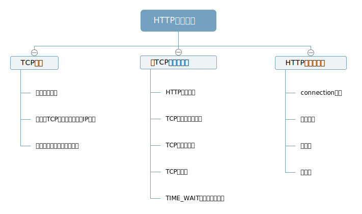

## HTTP连接管理

## 
- TCP是可靠的数据管道，会按序，无差错地承载数据。
- TCP流是分段的，由IP分组传送，从一个IP地址发送到一个IP地址，   
  IP分组包括：   
  - IP分组首部，包含了源和目的IP地址   
  - TCP段首部，TCP端口号，TCP控制标记   
  - TCP数据块   
- 任意时刻计算机都有几条TCP处于打开的状态，IP地址可以将你连接到正确的计算机，而端口号可以连接到正确的应用程序。  
##   
- 握手时延，每次交换数据，客户端和服务器之前都会交换一系列的IP分组。   
  - 分组`SYN`标记， 连接请求   
  - 分组`SYN + ACK`标记，连接请求已经接受   
  - 客户端向服务器发送一条确认信息，（允许在这个确认分组中发送数据）。   
  产生的结果是，基本上在确认分组的时候就可以承载整个请求报文，响应报文也可以放到一个IP分组分组中，所以握手很可能花费了50%的时间。   
- 延迟确认   
 因特网本省无法保证可靠传输，所以TCP有自己的确认机制，每个接受者收到数据都会向发送者发送确认分组。没收到则会重发数据。   
 报文很小，TCP允许发往相同方向的数据分组中“稍带”，为了找到同向数据分组的可能性，TCP实现了延迟算法，（100～200ms）在这个期间会讲确认分组放在缓冲区间，  不能“捎带”，会单独传送。      
-  慢启动   
  TCP自我调节性能，越是成功地传输，越提高传输的速度。   
- TIME_WAIT防止端口重用   
  TCP断点关闭的时候，会记录一段时间（通常 2min）所关闭的IP地址端口号，确保在这个时间内不会有相同的地址和端口号新连接。   
  构建一条TCP连接的四个值中，只有源端口号可以更改，客户端每次连接到新的服务器上的时候都有新的源端口号，假如端口有限（6000个）      
  连接率就为6000 ／ 120s 确保服务器的连接率不高于500次，就可以确保不会遇到TIME_WAIT的问题。   
## 
-  `connection`: 在客户端和源端服务器之间存在一串（代理，高速缓存等）。从客户端开始，http报文将经过这些设备。   
    connection可以取值：   
    - HTTP首部字段   
    - 任意标签值   
    - close：本次事务结束时关闭持久连接
    如果包含一个首部字段，接收端解析，应用，将报文转发给下一跳地址之前删除connection首部及其列出的所有首部。  
-  HTTP允许客户端打开多条连接    
-  持久化，去除了频繁连接／关闭的开销，HTTP1.1 默认激活。
   `keep-Alive`: 客户端通过包含connection: Keep-Alive 首部请求将一条连接保持在打开状态，服务器愿意则在响应中包含相同的首部。如果响应中没有connection: Keep-Alive，客户端认为服务器不支持。
   `keep-Alive`行为调节：timeout 服务器希望将连接保持在活跃状态的时间
                        max 服务器还希望为多少个事务保持此连接的活跃状态
    `Keep-Alive: max = 5, timeout = 120` 服务器最多还会为另外5个事务保持连接的打开状态，或者将打开状态保持到连接空闲了2分钟之后。
    总结：
    通过`connection: Keep-Alive`判断是否进行持久连接。
    在不关闭连接的情况下可确定报文实体主体部分的长度，才能将连接保持在打开状态（实体的主体部分有正确的content-length）事务处理的另一段需要监测一条报文的结束和另一条报文的开始。
    代理必须执行connection规则。

    假如不执行connection规则：
    代理盲目转发，客户端和服务器都认为在进行Keep-Alive 但是代理一无所知，认为同一条连接上不会有其他请求进来，所以会忽略，只有在超时的时候连接才会关闭。
-   管道化：响应到达之前，将多条请求放入队列。
    前提是持久连接，
    按照请求顺序回送HTTP响应，
    HTTP客户端做好连接会在任意时刻关闭的准备，
    客户端不该管道化的方式发送POST请求，出错的时候客户端不知道服务器执行了哪些请求，无法安全地重试POST这样的非幂等请求。
-   `Content-Length`: 描述响应主体的尺寸，服务器连接关闭的时候能知道数据的真实末尾，实际传输长度与Content-Length不匹配，接收端应该质疑长度的正确性，      但是接收端如果是缓存代理，就不应该妄图‘校正’。
-    重试以及幂等性：
    客户端将大量请求放入队列中，连接一旦关闭则需要进行重新调度，
    有些事务，比如哦GET一个html页面，可以反复执行很多次，也不会有什么变化，而POST一个订单，执行很多次就会有很多订单，如果一个事务不管执行多少次得到的结果都是一样那就是幂等的。
-   正常关闭连接：
    TCP连接的每一端都有一个输入输出队列。放入一段输入队列的数据都会在另一端的输出队列中，
    关闭输出信道总是安全的，连接的另一段从缓冲区读出所有数据之后收到一条通知说明流结束了，这样就知道连接关闭，
    关闭输入信道是危险的，除非你知道另一端不再发送数据。如果另一端向你已关闭的输入信道发送数据，操作系统就会向另一端的机器回送TCP被对端重置的报文，删除对端还未读取的缓存数据，假如已经发送了10条管道化请求响应也已经收到，发送第11条的时候连接关闭了，然后就会发生重置。