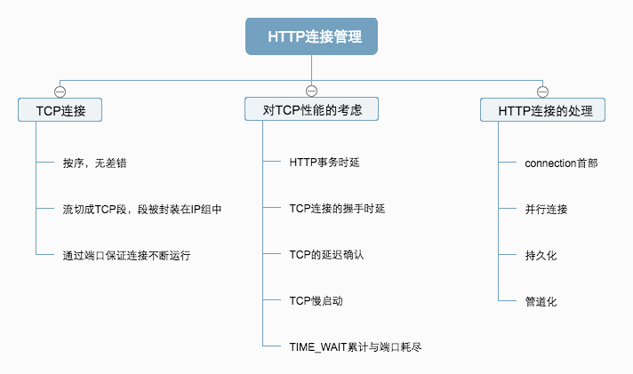

## HTTP连接管理

## 
- TCP是可靠的数据管道，会按序，无差错地承载数据。
- TCP流是分段的，由IP分组传送，从一个IP地址发送到一个IP地址，   
  IP分组包括：   
  - IP分组首部，包含了源和目的IP地址   
  - TCP段首部，TCP端口号，TCP控制标记   
  - TCP数据块   
- 任意时刻计算机都有几条TCP处于打开的状态，IP地址可以将你连接到正确的计算机，而端口号可以连接到正确的应用程序。  
##   
- 握手时延，每次交换数据，客户端和服务器之前都会交换一系列的IP分组。   
  - 分组`SYN`标记， 连接请求   
  - 分组连接请求已经接受   
  - 客户端向服务器发送一条确认信息，（允许在这个确认分组中发送数据）。   
  产生的结果是，基本上在确认分组的时候就可以承载整个请求报文，响应报文也可以放到一个IP分组分组中，所以握手很可能花费了50%的时间。   
- 延迟确认   
 因特网本省无法保证可靠传输，所以TCP有自己的确认机制，每个接受者收到数据都会向发送者发送确认分组。没收到则会重发数据。   
 报文很小，TCP允许发往相同方向的数据分组中“稍带”，为了找到同向数据分组的可能性，TCP实现了延迟算法，（100～200ms）在这个期间会讲确认分组放在缓冲区间，  不能“捎带”，会单独传送。      
-  慢启动   
  TCP自我调节性能，越是成功地传输，越提高传输的速度。   
- TIME_WAIT防止端口重用   
  TCP断点关闭的时候，会记录一段时间（通常 2min）所关闭的IP地址端口号，确保在这个时间内不会有相同的地址和端口号新连接。   
  构建一条TCP连接的四个值中，只有源端口号可以更改，客户端每次连接到新的服务器上的时候都有新的源端口号，假如端口有限（6000个）      
  连接率就为6000 ／ 120s 确保服务器的连接率不高于500次，就可以确保不会遇到TIME_WAIT的问题。   
