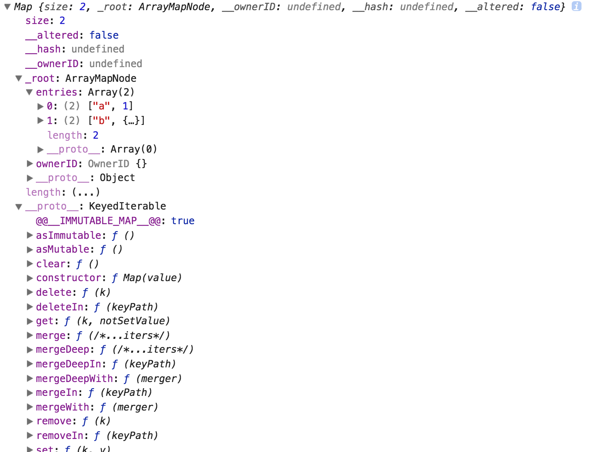

## what
无序的，(key, value)集合。
## like
```js
const map1 = Map({a: 1,  b: {c: 2}});
```

大概可以看出有一些私有属性: _hash, _ownerID   
size: 大小   
在 _root 下有该map结构的 [key, value]   
以及从`KeyedCollection`继承了   
`set, get, delete, delete merge .... `众多方法。   
猜一下大概是大概就是围绕着 entries:[] 展开一些列的set，get
## 实现
https://github.com/facebook/immutable-js/tree/master/src   
src/utils/里有一些很有意思的辅助方法；
数组，对象浅拷贝，判断简单对象   
类数组：
``` js
return value && typeof value.length === 'number';
```
mixin（包括Symbol类型）：
```js
function mixin(ctor, methods) {
  const keyCopier = key => {
    ctor.prototype[key] = methods[key];
  };
  Object.keys(methods).forEach(keyCopier);
  Object.getOwnPropertySymbols &&
  Object.getOwnPropertySymbols(methods).forEach(keyCopier);
  return ctor;
}
```
Map 入口：传入的value有意义 通过 makeMap(emptyMap()) 返回一个Map对象 经过 withMutations 之后map对象加入了ownerID  
```js
emptyMap().withMutations(map => {
  const iter = KeyedCollection(value);
  assertNotInfinite(iter.size);
  iter.forEach((v, k) => map.set(k, v));
});
```
`KeyCollection(value)` 通过  `new ObjectSeq(value)` 生成对象：
```js
size: Object.keys(value).length
_keys: Object.keys(value)
_object: value的引用
```
接下来就是取到k, v生成entries的过程
以前错误的理解
```js
const map2 = Map(map1);
map1 === map2
```
判断到是一个map对象 直接返回 map2只是对map1的引用 所以结果是为true的，
在对象内部通过私有属性判断是不是一个immutable对象。
只有在set操作之后才会返回一个全新的对象。
set操作的时候 进行updateNode 即update entries
新的 entries = this.entries 即直接引用原来的entries 在此基础上在进行新的肤质操作
所以这可以解释
```js
window.map1 = Map({
  a: {str: 'str'},
  b: {
    c: 2
  }
});
window.map2 = map1.set('d', 4);
map1.get('b') === map2.get('b') // true
```
即称为共享结构
